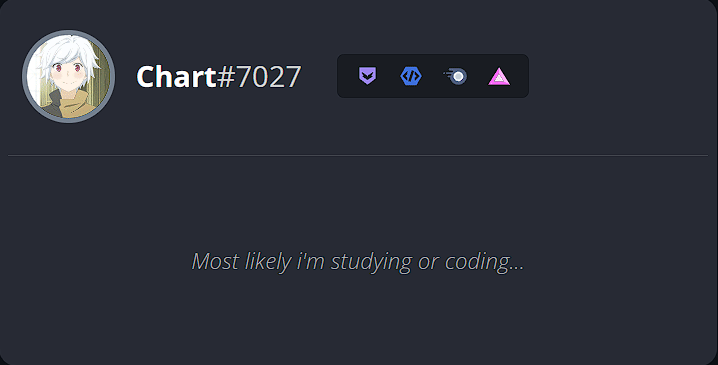

# Welcome to my profile! 

Hello, I'm William, a programmer, developer, and aspiring technologist who is dedicated to learning and acquiring new knowledge every day. I am passionate about exploring the wide range of technologies available today. I consider myself a self-taught programmer, constantly expanding my skills and knowledge in this field that I'm truly passionate about.

I enjoy creating websites, applications, and animations using CSS, as well as working on both large and small projects. I currently have several website projects in my repositories that I've been actively developing. Everything in my README is written in code and is accessible in my repositories. Please feel free to use or modify any of it if you find it useful! Thank you for visiting my profile.

## Discord Activity 
 

 

## Github Stats 
 

</nobr>

 

## social media 

<!--YouTube -->

<!-- Instagram -->

 
 

emoji website link: https://animated-fluent-emoji.vercel.app

<!-- ## Skills  
In recent years, I have been learning new technologies and languages. These are the ones I learned and plan to learn very soon.
| **#** | **Language** | **Proficiency** |
| :------------------------------------------------------------------------------------------------------------: | :----------: | :-------------------------------------------------------------------: |
| | ` HTML5 ` | 
| | ` CSS3 ` | 
| | ` JavaScript ` | 
| | ` TypeScript ` | 
| | ` NODEJS ` | 
| | ` NEXTJS ` | 
| | ` REACT ` | 
| | ` C# ` | 
| | ` C ` | 
| | ` PYTHON ` | 
| | ` PHP ` | 
| | ` SQL ` | 
| | ` DJANGO ` | 
| | ` JAVA ` | 
| | ` GRAPHQL ` | 
| | ` GIT ` | 
| | ` PHOTOSHOP ` | 

 

 -->
