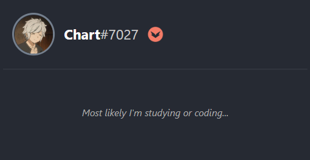

# Welcome to my profile! 

Hello, I'm William, a programmer, developer and future and technologist, who seeks to learn, and know every day, new knowledge and the various technologies that we have today, despite being studying ADS college, I consider myself a self-taught programmer, constantly learning and always looking to improve my skills and knowledge in the area.

I like to create websites, applications, make animations with css, drawings among other things, I have some website projects in my repositories that I've done in recent times. 

## Skills  

In recent years, I have been learning new technologies and languages. These are the ones I learned and plan to learn very soon.

| **#** | **Language** | **Proficiency** |
| :------------------------------------------------------------------------------------------------------------: | :----------: | :-------------------------------------------------------------------: |
| | ` HTML5 ` | 
| | ` CSS3 ` | 
| | ` JavaScript ` | 
| | ` TypeScript ` | 
| | ` NODEJS ` | 
| | ` NEXTJS ` | 
| | ` REACT ` | 
| | ` C# ` | 
| | ` C ` | 
| | ` PYTHON ` | 
| | ` PHP ` | 
| | ` SQL ` | 
| | ` DJANGO ` | 
| | ` JAVA ` | 
| | ` GRAPHQL ` | 
| | ` GIT ` | 
| | ` PHOTOSHOP ` | 
<!-- | | `  ` |  -->

 

 

## Github Stats 

<nobr>

</nobr>

## Discord Activity 

