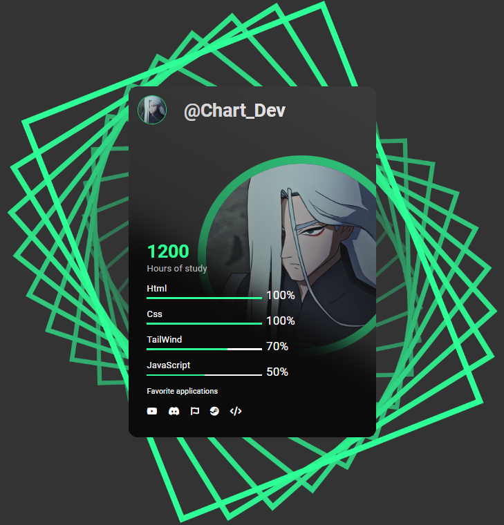

# Welcome to my profile! 

Hello, I'm William, a programmer, developer and future technologist, who seeks to learn, and discover new knowledge every day and the various technologies that we have today, I consider myself a self-taught programmer, constantly learning and always seeking to improve my skills and knowledge in this area that I love so much.

I like to create websites, applications, animations with CSS, large and small projects, among other things, I have some website projects in my repositories that I have been working on recently, and everything I have in my readme is made with code, and is available in my repositories, feel free to use or modify if you like! thank you very much! for visiting my profile!

## Card Statistics 
 

 

## Discord Activity 
 

 

## Github Stats 
 

</nobr>

<!-- ## Skills  

In recent years, I have been learning new technologies and languages. These are the ones I learned and plan to learn very soon.

| **#** | **Language** | **Proficiency** |
| :------------------------------------------------------------------------------------------------------------: | :----------: | :-------------------------------------------------------------------: |
| | ` HTML5 ` | 
| | ` CSS3 ` | 
| | ` JavaScript ` | 
| | ` TypeScript ` | 
| | ` NODEJS ` | 
| | ` NEXTJS ` | 
| | ` REACT ` | 
| | ` C# ` | 
| | ` C ` | 
| | ` PYTHON ` | 
| | ` PHP ` | 
| | ` SQL ` | 
| | ` DJANGO ` | 
| | ` JAVA ` | 
| | ` GRAPHQL ` | 
| | ` GIT ` | 
| | ` PHOTOSHOP ` | 

 

 -->